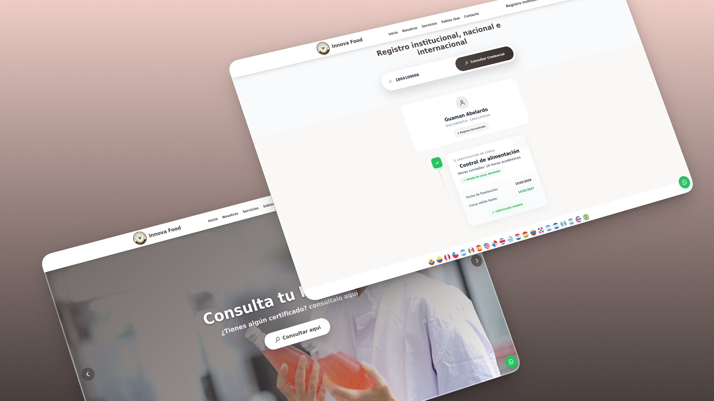
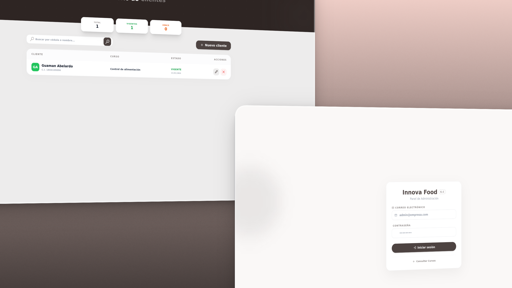

<div align="center">


<span style="font-size: 30px; font-weight: bold; color: #4d4341;">CertiCheck</span>

<p><span style="font-weight: bold">INNOVAFOOD G.C - </span>Gestión y consulta de historial de cursos de forma simple y segura.</p>


</div>

<div align="center">
  
  
</div>

## 🧩 Funcionalidades

- Ingreso de administración.
  - Registro, edición y eliminación de clientes.
- Consulta publica por cédula.
  - Estado de vigencia de cursos (vigente/caducado) según fecha de vencimiento.

## 👥 Equipo de desarrollo

<div align="center">

| **Desarrollador** | **Rol**  |                   **GitHub**                   |
| :---------------: | :------: | :--------------------------------------------: |
|   **Aracelly**    | Frontend | [@Aracelly126](https://github.com/Aracelly126) |
|     **Elías**     | Backend  |  [@JosliBlue](https://github.com/JosliBlue/)   |

</div>

## 🛠️ Comandos Útiles

```bash
# Preparar entorno desde cero (incluye migrate:fresh --seed)
composer run prepare

# Limpiar y recachear configuración/rutas
composer run clear

# Servidor de desarrollo
composer run dev

# Ejecutar tests
php artisan test --compact
```

## 📝 Notas

- El seeder administrativo toma `ADMIN_EMAIL` y `ADMIN_PASSWORD` desde `.env`.
- Si no defines esas variables, la creación del usuario admin puede fallar o quedar invalida.
- Si cambias de motor de base de datos, actualiza los valores DB\_\* en `.env`.
